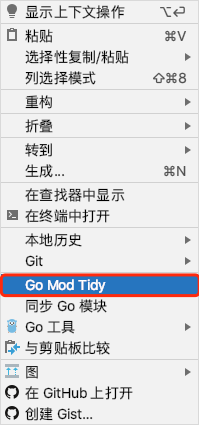

# GFVA小白说明书

## 1. [目录结构](./directory/)

## 2. 实战基础操作

> 本项目的编程环境

|                                              | 推荐      | 开发环境(指的是开发此项目的开发环境) |
| -------------------------------------------- | --------- | ------------------------------------ |
| [Golang](https://golang.google.cn/dl/)       | 1.11      | 1.14.4                               |
| [MySQL](https://www.mysql.com/)              | 8.0       | 8.0.19                               |
| [nodejs](https://nodejs.org/zh-cn/download/) | 最新的LTS | 12.16.1                              |

### 2.1 下载或克隆项目

```shell
git clone https://github.com/flipped-aurora/gf-vue-admin.git
```

### 2.2 安装依赖

#### 2.2.1 前端项目下载依赖

```js
// 进入web文件夹
cd web
// 使用npm或者cnpm进行下载依赖
cnpm i || npm i
```

#### 2.2.2 后端项目下载依赖

```go
# 注意不要使用gopm

# 开启go module 
go env -w GO111MODULE=on
# 设置代理
go env -w GOPROXY=https://goproxy.io,direct
```

### 2.3 初始化

#### 2.3.1 数据库初始化数据

1. 新建数据库,名字自取.
2. 将server/document/gf-vue-admin.sql导入到新建的数据库

#### 2.3.2 server的配置文件

1. 配置文件位于server/config
2. 按需修改config.toml文件
3. 如需详细的配置文件,[点我](./config/)

## 3.前端项目

- 前端是Vue项目
- 使用VsCode或者WebStorm打开web文件夹
- 使用`npm run serve`或者`cnpm run serve`即可启动项目

## 4.后端项目

- 后端是Golang项目
- 使用VsCode(需要自行下载VsCode的go开发插件)或者Goland打开server文件夹,`以Goland为例进行说明`
- 进入GoLand的File → settings → Go → Go Modules，将 Environment 项的值设置为`GOPROXY=https://goproxy.io,direct`
- 打开server/go.mod文件,在文件空白处鼠标右键点击`Go Mod Tidy`
- 

- 完成后打开server/main.go, 在文件空白处鼠标右键点击`运行'go build main.go'`,或者使用图中红色框的右边的快捷键组合进行启动项目

- 

## 5.自动代码生成(数据库表)

- 点击左侧菜单中的**系统工具** >  **代码生成器** ,代码生成器是用来生成CURD代码的。
- 点击`点这里从现有数据库创建代码`
- 

- 选择`数据库名`以及`表名`
- 

- 点击**使用此表创建**
- 

- 自行编辑好各个`Filed`的所需的搜索条件,或者其他自己要修改的地方, 修改后点击生成代码
- 

- 点击后就可以看到左下角或者下载内容里有一个下载好了的gf-vue-admin.zip文件
- 

解压gf-vue-admin.zip后会看到里面有个 autoCode 文件夹，autoCode 里的 te 文件夹为自动生成的后端代码，fe文件夹为自动生成的前端代码。


- te文件夹 → 后端代码：
	- api 下的 `.go` 文件放到 server/app/api/v1 下。
	- `user(这个文件夹是动态的,具体的是PackageName(文件名称)这个字段)` 下的`整个文件夹`放到server/app/model 下。
	- request 下的 `.go` 文件放到后端项目中的 server/app/api/request下。
	- router 下的 `.go` 文件放到后端项目中的 server/router 下。
	- service 下的 `.go` 文件放到后端项目中的 server/app/service 下。
- fe文件夹 → 前端代码：
	- api 下的 `.js` 文件放到 web/src/api 下。
	- table 下的 `.vue` 文件放到前端项目中的 web/src/api/view/`(PackageName(文件名称)自建)`下。

## 6. 注册路由

打开`server/router/router.go`文件,在InitializeRouters方法中,自行调用生成autoCode/te/router的`.go`文件的方法

## 7. 配置目录菜单

进入系统 超级管理员 → 菜单管理 菜单，点击 **新增根菜单** 按钮，配置菜单信息。

- 路由name：对应进入列表显示页面时的访问路径
- 路由path：选中后边的“添加参数”后才可以输入，对应进入列表显示页面时访问路径后的参数*（没用过，目测是酱婶的）*
- 是否隐藏：是否在系统左侧目录菜单显示时，隐藏掉该目录菜单
- 父节点Id：该目录菜单的父级目录菜单。这里是自动填充的数据，不需要自己操作
- 文件路径：对应前端项目中 /view/struct简称文件夹（自建）/struct简称.vue 文件
- 展示名称：该目录菜单显示在系统左侧目录菜单中的名称
- 图标：该目录菜单显示在系统左侧目录菜单中的图标
- 排序标记：用于调整该目录菜单在系统左侧目录菜单中显示的上下位置*（我猜的）*
- keepAlive：是否使用keepAlive缓存*（太菜了，虽然知道干嘛用但是几行字解释不了，如有需要，请自行百度）*

以上配置好后，点击 **确定** 按钮，完成菜单配置。

## 8. 配置后端接口

如果是自动生成的代码，这里接口会自动配置好。

如果是自己写的业务代码，这里需要配置好后端接口。进入系统 超级管理员 → api管理 菜单，点击 **新增api** 按钮，配置接口信息。

- 路径：就是接口路径，比如前端项目中 src → api → struct简称.js 每个方法里的 url
- 请求：根据接口实际选择即可
- api分组：对应 struct 简称
- api简介：对api的简要说明

以上配置好后，点击 **确定** 按钮，完成接口配置。

## 9. 配置角色权限

进入系统 超级管理员 → 角色管理 菜单，找到需要设置权限的角色，点击对应的 **设置权限** 按钮，配置角色相关权限。

- 角色菜单：勾选该角色可以访问的目录菜单
- 角色api：勾选该角色可以访问的接口

## 10 完善新增表单弹窗/页面

我们可以在系统中看到我们所创建的结构体数据列表页面。目前，这个页面已经是可以实现 **删除**、**查询** 功能了，**新增**、**修改** 功能仍然需要我们自己完善一下弹窗表单。

进入系统 系统工具 → 表单生成器 菜单，根据自己的实际需求，将左侧组件拖拽至中间画布区域，并在右侧设置组件属性。

- 组件类型：默认是左侧选中的组件类型，这里还可以再进行调整
- 字段名：对应 Step3 中的 **FieldJSON** 字段
- 标题：即组件label
- 占位提示：。。。就是占位提示
- ……：*剩下的我都没试，按需自行试用*

把所有组件上边几个基本的组件属性填好以后，点击画布上方的 **复制代码** 按钮，会出现一个弹窗，让我们选择 **生成类型** 是 页面 还是 弹窗。我用的时候选的页面，具体内容应该是没差的，这里选择哪个应该不影响我们目前的需求。然后点击 **确定** 按钮，就成功复制到了我们的表单代码。

接下来，

- 随便找个记事本或者地方，把代码复制到里边。
- 在复制出来的代码中，取出 `<el-form>……</el-form>` 部分代码，覆盖掉前端项目中 src → view → struct 简称文件夹（自建） → struct简称.vue 中 `此处请使用表单生成器生成form填充 表单默认绑定 formData 如手动修改过请自行修改key` 这句话。
- 在复制出来的代码中，把 js 部分`data`方法里返回的对象复制到前端项目中，上边提及的 .vue 文件的 js 部分 `data` 方法的 `return` 对象里。（*这里表述有点乱。。但是前端一看代码就明白了。。。）*

## Finish

至此，一个单表基本业务结构体的数据列表显示，单表数据增加、删除、查找、更新功能全部搞定。